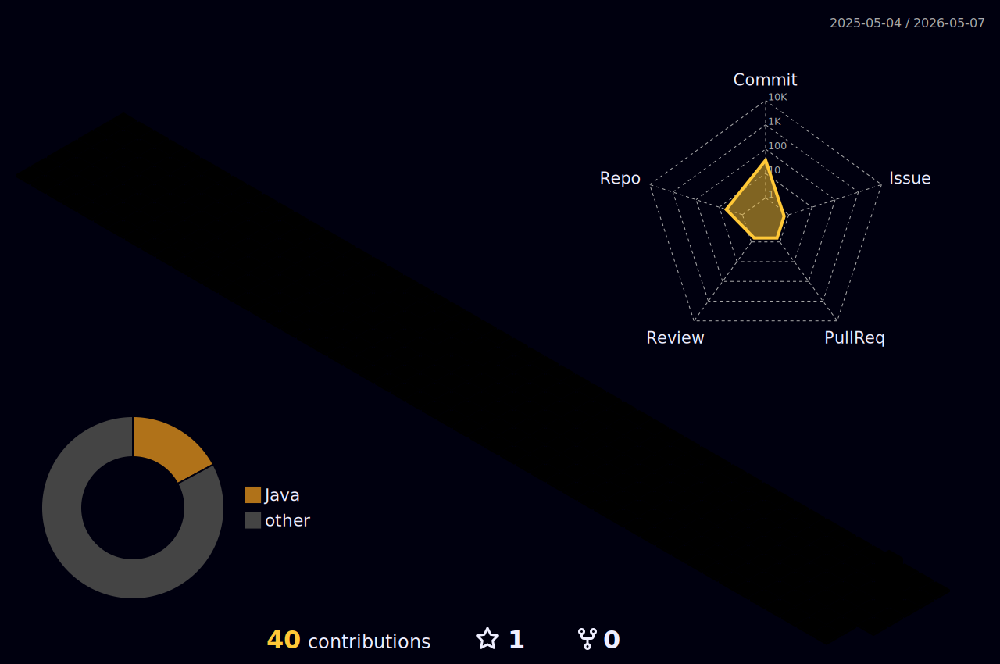

##  <b>Computer Science (Backend Developer)</b>

 

---

##  <b>Languages and Tools:</b>

<table>
  <tr>
    <td></td>
    <td></td>
    <td></td>
    <td></td>
    <td></td>
    <td></td>
    <td></td>
    <td></td>
    <td></td>
    <td></td>
    <td></td>
  </tr>
</table>

 

